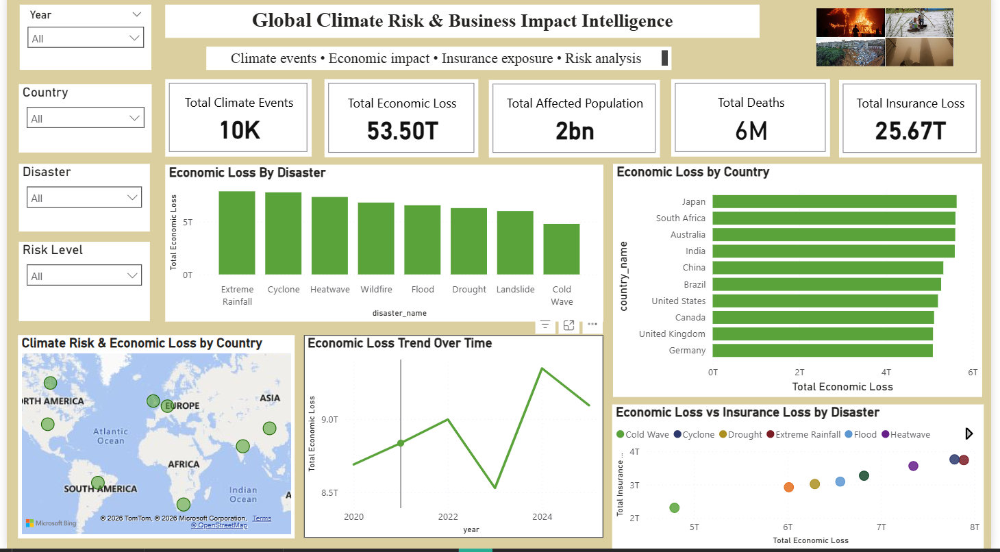
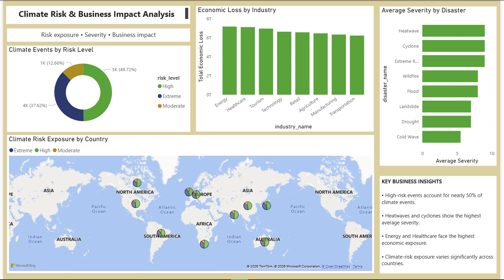
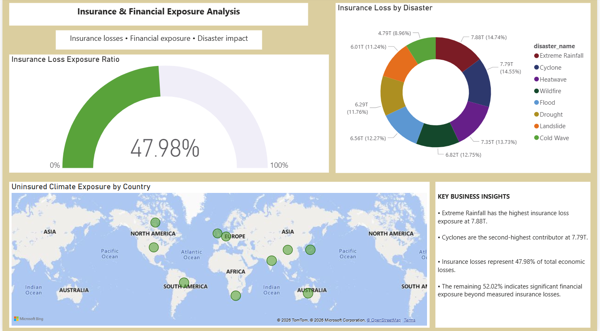

\#  Global Climate Risk \& Business Impact Intelligence


\##  Project Overview


An interactive Power BI Business Intelligence project that analyzes climate-related events across countries and industries to identify climate risk, economic losses, insurance coverage, and uninsured financial exposure.


The project combines MySQL, Power Query, DAX, and Power BI to transform climate-event data into actionable business insights.


\---


\##  Business Problem


Organizations need to understand the financial and operational impact of climate-related events.


This project answers key business questions:


\- Which countries have higher climate-risk exposure?

\- Which disasters cause the highest economic losses?

\- Which industries are most affected?

\- How much economic loss is covered by insurance?

\- Where is significant uninsured financial exposure?


\---


\##  Dataset


\- 10,200+ climate-event records

\- Country, disaster, date, industry, weather and risk information

\- Economic loss and insurance loss

\- Affected population and deaths

\- Temperature, rainfall, carbon emissions and severity score


> **Note:** This project uses a synthetic dataset generated using Python. The climate-event and financial values are illustrative and do not represent actual reported climate or financial losses. The dataset is intended for demonstrating data generation, SQL data modeling, Power BI analysis, and dashboard development.


\---


\##  Data Model


The project uses a Star Schema.


\### Fact Table


\- `fact\_climate\_events`


\### Dimension Tables


\- `dim\_country`

\- `dim\_disaster`

\- `dim\_date`

\- `dim\_industry`

\- `dim\_weather`

\- `dim\_risk\_level`

\- `dim\_company\_sector`


A staging table was used to transform raw data before loading it into the final fact table.


\---


\## 🛠️ Tools \& Technologies


\- \*\*MySQL\*\* – Database and schema design

\- \*\*Power Query\*\* – Data cleaning and transformation

\- \*\*Power BI\*\* – Data modeling and dashboard development

\- \*\*DAX\*\* – KPI and analytical calculations


\---


\#  Power BI Dashboard


\## 1️⃣ Executive Dashboard


Provides an overview of climate events, economic loss, insurance loss, affected population and deaths.





\## 2️⃣ Risk \& Business Impact


Analyzes risk levels, disaster severity, country exposure and industry-level financial impact.





\## 3️⃣ Insurance \& Financial Exposure


Analyzes insurance losses and uninsured climate-related financial exposure across countries and disasters.





\---


\#  Key Insights


\- High-risk climate events contribute significantly to overall climate exposure.

\- Certain disasters generate substantially higher economic losses.

\- Climate-related financial impact varies across countries and industries.

\- Insurance covers only a portion of total economic losses.

\- Uninsured exposure highlights areas requiring stronger risk mitigation and insurance planning.


\---


\#  Business Recommendations


\- Prioritize high-risk and disaster-prone locations.

\- Review insurance coverage for high-exposure assets.

\- Strengthen climate-risk mitigation and business continuity planning.

\- Monitor uninsured financial exposure.

\- Use historical climate trends for financial and operational planning.


\---


\## 📁 Project Structure


```text

Global-Climate-Risk-Business-Impact-Intelligence/

│

├── PowerBI/

│   └── Global\_Climate\_Risk\_Business\_Impact.pbix

│

├── Data/

│   ├── fact\_climate\_events.csv

│   ├── dim\_country.csv

│   ├── dim\_disaster.csv

│   ├── dim\_date.csv

│   ├── dim\_industry.csv

│   ├── dim\_weather.csv

│   ├── dim\_risk\_level.csv

│   └── dim\_company\_sector.csv

│

├── SQL/

│   └── climate\_risk\_analysis.sql

│

├── Screenshots/

│   ├── Page1\_Executive\_Dashboard.png

│   ├── Page2\_Risk\_Business\_Impact.png

│   └── Page3\_Insurance\_Financial\_Exposure.png

│

└── README.md


## Skills Demonstrated

SQL | MySQL | Power Query | Power BI | DAX | Data Cleaning | Data Modeling | Star Schema | Data Visualization | Business Intelligence | Business Analysis


## Author

Pragya

Aspiring Data Analyst | SQL | Power BI | Python | Excel

